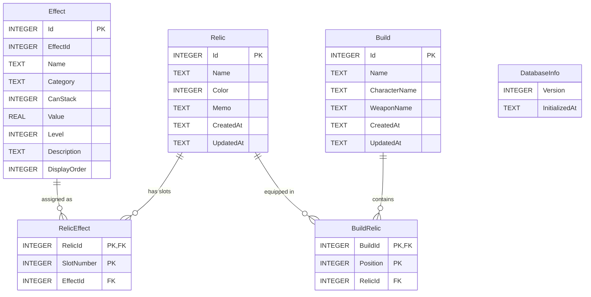
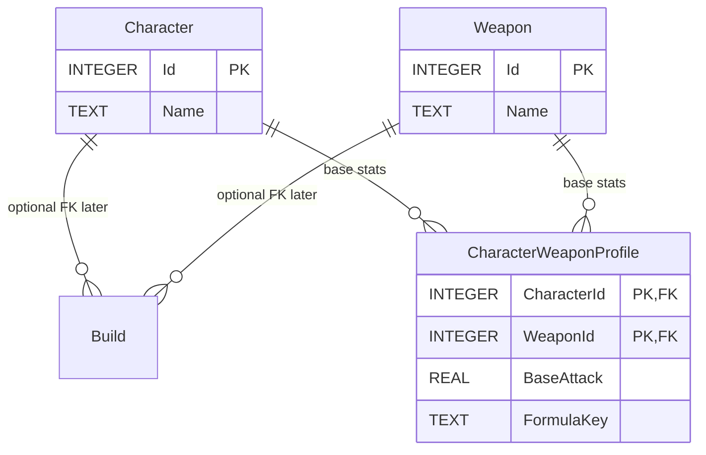

# SQLite テーブル設計

> 前提: [ドメインルール（最終版）](./ドメインルール.md)  
> エンジン: SQLite 3 / ADO.NET（`Microsoft.Data.Sqlite`）  
> 計算結果は保存しない。将来のキャラクター・武器別火力計算を拡張しやすい形にする。

---

## 1. 各テーブルの役割

| テーブル | 役割 | 将来拡張との関係 |
|---|---|---|
| **DatabaseInfo** | スキーマ Version と初期化日時 | DB マイグレーション判定に使用 |
| **Effect** | 効果マスタ。EffectId / Value / Level / CanStack など計算入力の定義 | 効果追加は行追加が基本。計算ロジックは持たない |
| **Relic** | ユーザー所持（登録）遺物。名前・色・メモ | 同一内容の複数行登録を許容 |
| **RelicEffect** | 遺物の効果スロット（1〜3）と Effect の対応 | スロット構成の正規化 |
| **Build** | ビルドヘッダ。表示名・紐づくキャラ/武器の識別情報 | 現状は名前文字列。将来は Character / Weapon マスタへ FK 化可能 |
| **BuildRelic** | ビルドの装備スロット（1〜6）と Relic の対応 | **同一 RelicId の複数 Position 配置を許容** |

計算結果（最終火力・ログ等）用テーブルは **作らない**。

SQL 実体は次の配置で管理する。

- スキーマ: `src/NightreignRelicSimulator.Data/Sql/Schema/*.sql`
- CRUD クエリ: `src/NightreignRelicSimulator.Data/Sql/{Entity}/*.sql`

---

## 2. ER図



### 将来拡張イメージ（本版では未作成）



- 現状の `Build.CharacterName` / `WeaponName` は UI・検索用の文字列。
- 将来マスタ化する場合は `CharacterId` / `WeaponId` を nullable FK で追加し、名前列は互換のため残すかビューで吸収する。
- 基礎攻撃力やキャラ固有式は `CharacterWeaponProfile`（または同等）と `DamageCalculator` の戦略切替で表現し、**計算結果テーブルは引き続き作らない**。

---

## 3. 主キー / 外部キー / UNIQUE / インデックス

### 3.1 制約一覧

| テーブル | PK | FK | UNIQUE | 備考 |
|---|---|---|---|---|
| DatabaseInfo | なし（単一行運用） | — | — | Version / InitializedAt。マイグレーション管理 |
| Effect | `Id` | — | — | 名称の一意は必須にしない（同名効果の区別は Id） |
| Relic | `Id` | — | — | 同名複数登録を許容するため Name UNIQUE なし |
| RelicEffect | `(RelicId, SlotNumber)` | `RelicId`→Relic, `EffectId`→Effect | PK がスロット一意を兼ねる | SlotNumber は 1〜3 |
| Build | `Id` | — | — | |
| BuildRelic | `(BuildId, Position)` | `BuildId`→Build, `RelicId`→Relic | PK が位置一意を兼ねる | **(BuildId, RelicId) は UNIQUE にしない**（複数装備可） |

### 3.2 インデックス方針

| インデックス | 目的 |
|---|---|
| `IX_Effect_DisplayOrder` | 効果マスタの UI 一覧 |
| `IX_Effect_Category` | カテゴリ絞り込み |
| `IX_Effect_StackGroup` | 管理・調査用（計算自体はメモリ上） |
| `IX_Relic_Name` | 遺物名検索 |
| `IX_Relic_Color` | 色フィルタ |
| `IX_RelicEffect_EffectId` | 効果から遺物逆引き、削除時確認 |
| `IX_Build_Name` | ビルド名検索 |
| `IX_Build_CharacterName` | キャラ別ビルド一覧（将来拡張の地ならし） |
| `IX_Build_WeaponName` | 武器別ビルド一覧（同上） |
| `IX_BuildRelic_RelicId` | 遺物削除前の参照確認、遺物が使われているビルド検索 |

SQLite では FK 列に自動 index は付かないため、参照・検索に使う FK / フィルタ列へ明示 index を付ける。

---

## 4. CREATE TABLE 文

型方針:

- 真偽値: `INTEGER`（0/1）
- 倍率: `REAL`
- 日時: `TEXT`（ISO 8601、UTC 推奨: `yyyy-MM-ddTHH:mm:ss.fffZ`）
- 色: `INTEGER`（アプリの `RelicColor` enum 値）
- `StackGroup`: 重複不可効果のみ意味を持つ。重複可は空文字可

```sql
PRAGMA foreign_keys = ON;

-- ---------------------------------------------------------------------------
-- DatabaseInfo: スキーマバージョン（単一行）
-- ---------------------------------------------------------------------------
CREATE TABLE IF NOT EXISTS DatabaseInfo (
    Version       INTEGER NOT NULL,
    InitializedAt TEXT    NOT NULL
);

-- ---------------------------------------------------------------------------
-- Effect: 効果マスタ（計算入力の定義。ロジックは持たない）
-- DisplayOrder は UI 表示順のみ。計算順には使わない。
-- ---------------------------------------------------------------------------
CREATE TABLE IF NOT EXISTS Effect (
    Id           INTEGER NOT NULL PRIMARY KEY AUTOINCREMENT,
    Name         TEXT    NOT NULL,
    Category     TEXT    NOT NULL DEFAULT '',
    Multiplier   REAL    NOT NULL,
    CanStack     INTEGER NOT NULL DEFAULT 1
                 CHECK (CanStack IN (0, 1)),
    StackGroup   TEXT    NOT NULL DEFAULT '',
    Description  TEXT    NOT NULL DEFAULT '',
    DisplayOrder INTEGER NOT NULL DEFAULT 0
);

CREATE INDEX IF NOT EXISTS IX_Effect_DisplayOrder ON Effect (DisplayOrder);
CREATE INDEX IF NOT EXISTS IX_Effect_Category     ON Effect (Category);
CREATE INDEX IF NOT EXISTS IX_Effect_StackGroup   ON Effect (StackGroup);

-- ---------------------------------------------------------------------------
-- Relic: 登録遺物（同一内容の複数行登録を許容）
-- ---------------------------------------------------------------------------
CREATE TABLE IF NOT EXISTS Relic (
    Id        INTEGER NOT NULL PRIMARY KEY AUTOINCREMENT,
    Name      TEXT    NOT NULL,
    Color     INTEGER NOT NULL DEFAULT 0,
    Memo      TEXT    NOT NULL DEFAULT '',
    CreatedAt TEXT    NOT NULL,
    UpdatedAt TEXT    NOT NULL
);

CREATE INDEX IF NOT EXISTS IX_Relic_Name  ON Relic (Name);
CREATE INDEX IF NOT EXISTS IX_Relic_Color ON Relic (Color);

-- ---------------------------------------------------------------------------
-- RelicEffect: 遺物スロット 1〜3
-- ---------------------------------------------------------------------------
CREATE TABLE IF NOT EXISTS RelicEffect (
    RelicId    INTEGER NOT NULL,
    SlotNumber INTEGER NOT NULL,
    EffectId   INTEGER NOT NULL,
    PRIMARY KEY (RelicId, SlotNumber),
    CHECK (SlotNumber BETWEEN 1 AND 3),
    FOREIGN KEY (RelicId)  REFERENCES Relic (Id)  ON DELETE CASCADE,
    FOREIGN KEY (EffectId) REFERENCES Effect (Id) ON DELETE RESTRICT
);

CREATE INDEX IF NOT EXISTS IX_RelicEffect_EffectId ON RelicEffect (EffectId);

-- ---------------------------------------------------------------------------
-- Build: ビルドヘッダ
-- CharacterName / WeaponName は現状文字列。
-- 将来 CharacterId / WeaponId を追加しても破壊的変更を最小化できる。
-- ---------------------------------------------------------------------------
CREATE TABLE IF NOT EXISTS Build (
    Id            INTEGER NOT NULL PRIMARY KEY AUTOINCREMENT,
    Name          TEXT    NOT NULL,
    CharacterName TEXT    NOT NULL DEFAULT '',
    WeaponName    TEXT    NOT NULL DEFAULT '',
    CreatedAt     TEXT    NOT NULL,
    UpdatedAt     TEXT    NOT NULL
);

CREATE INDEX IF NOT EXISTS IX_Build_Name          ON Build (Name);
CREATE INDEX IF NOT EXISTS IX_Build_CharacterName ON Build (CharacterName);
CREATE INDEX IF NOT EXISTS IX_Build_WeaponName    ON Build (WeaponName);

-- ---------------------------------------------------------------------------
-- BuildRelic: 装備位置 1〜6
-- 同一 Build 内で同じ RelicId を複数 Position に置ける（UNIQUE(BuildId, RelicId) なし）
-- ---------------------------------------------------------------------------
CREATE TABLE IF NOT EXISTS BuildRelic (
    BuildId  INTEGER NOT NULL,
    Position INTEGER NOT NULL,
    RelicId  INTEGER NOT NULL,
    PRIMARY KEY (BuildId, Position),
    CHECK (Position BETWEEN 1 AND 6),
    FOREIGN KEY (BuildId) REFERENCES Build (Id) ON DELETE CASCADE,
    FOREIGN KEY (RelicId) REFERENCES Relic (Id) ON DELETE RESTRICT
);

CREATE INDEX IF NOT EXISTS IX_BuildRelic_RelicId ON BuildRelic (RelicId);
```

### 削除時の挙動

| 操作 | 挙動 |
|---|---|
| Relic 削除 | `RelicEffect` は CASCADE。ビルドから参照中なら `BuildRelic` が RESTRICT で削除失敗 → Service で先に解除 or 確認 |
| Effect 削除 | 遺物スロットから参照中なら RESTRICT → マスタ削除前に付け替えが必要 |
| Build 削除 | `BuildRelic` は CASCADE |

---

## 5. ドメイン定数との対応

| 定数 | 値 | DB 上の表現 |
|---|---|---|
| 効果スロット数 | 3 | `RelicEffect.SlotNumber` CHECK 1..3 |
| ビルド遺物数 | 6 | `BuildRelic.Position` CHECK 1..6 |
| CanStack | bool | INTEGER 0/1 |
| RelicColor | enum | INTEGER |

---

## 6. 将来のキャラクター・武器別火力計算への備え

本版でやること / やらないこと:

| やること | やらないこと |
|---|---|
| Build に CharacterName / WeaponName を持たせる | Character / Weapon マスタを今すぐ作る |
| 名前列に索引を付け、キャラ/武器別一覧を可能にする | 基礎攻撃力や最終火力を Build に保存する |
| Calculator をキャラ非依存の純関数に近い形で設計 | キャラ別の計算結果キャッシュテーブル |

推奨拡張手順（将来）:

1. `Character` / `Weapon` テーブル追加  
2. `Build` に `CharacterId` / `WeaponId`（NULL 可）追加  
3. 必要なら `CharacterWeaponProfile(BaseAttack, FormulaKey)` 追加  
4. `DamageCalculator` に `FormulaKey` 別戦略を追加（Excel 準拠を維持）  
5. 計算結果は従来どおり非永続

---

## 7. 次工程

1. 工程2: `SqliteInitializer`（ファイル生成・`PRAGMA foreign_keys`・本 CREATE の実行）  
2. Seed: Effect 初期データ投入  
3. Model / Repository 実装
